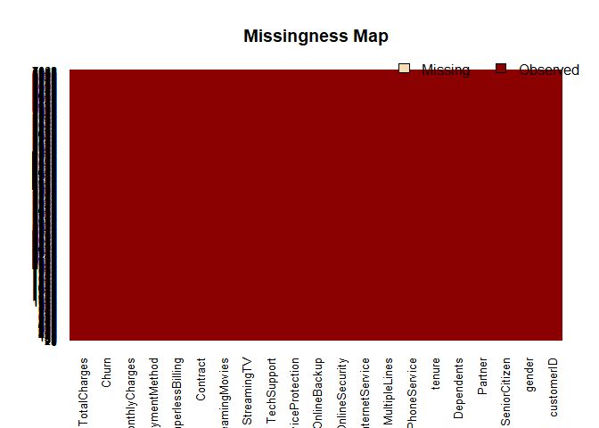
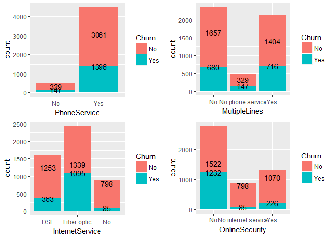
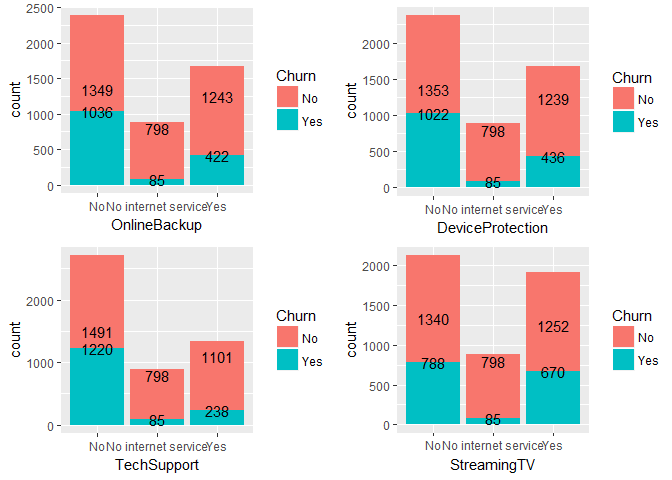
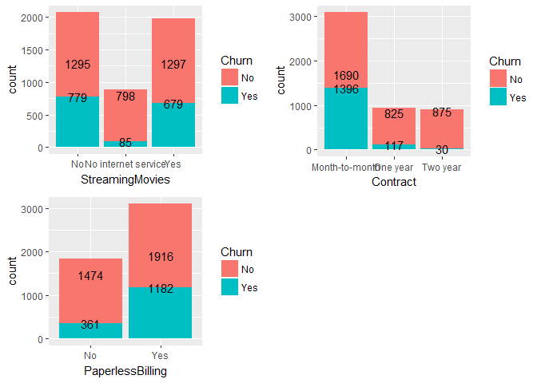
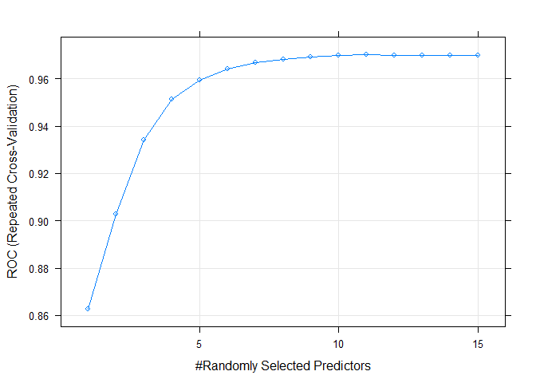

Churn\_analytics
================

\`\`\`

\#\# R Markdown
---------------

In this project we will be doing exploratory data analysis and build high performance models to predict customer churn. Let us start off by importing required libraries and reading in our data. ---

``` r
library(tidyverse)
```

    ## -- Attaching packages ---------------------------------- tidyverse 1.2.1 --

    ## v ggplot2 2.2.1     v purrr   0.2.4
    ## v tibble  1.4.2     v dplyr   0.7.4
    ## v tidyr   0.8.0     v stringr 1.3.0
    ## v readr   1.1.1     v forcats 0.3.0

    ## -- Conflicts ------------------------------------- tidyverse_conflicts() --
    ## x dplyr::filter() masks stats::filter()
    ## x dplyr::lag()    masks stats::lag()

``` r
library(tidyquant)
```

    ## Loading required package: lubridate

    ## 
    ## Attaching package: 'lubridate'

    ## The following object is masked from 'package:base':
    ## 
    ##     date

    ## Loading required package: PerformanceAnalytics

    ## Loading required package: xts

    ## Loading required package: zoo

    ## 
    ## Attaching package: 'zoo'

    ## The following objects are masked from 'package:base':
    ## 
    ##     as.Date, as.Date.numeric

    ## 
    ## Attaching package: 'xts'

    ## The following objects are masked from 'package:dplyr':
    ## 
    ##     first, last

    ## 
    ## Attaching package: 'PerformanceAnalytics'

    ## The following object is masked from 'package:graphics':
    ## 
    ##     legend

    ## Loading required package: quantmod

    ## Loading required package: TTR

    ## Version 0.4-0 included new data defaults. See ?getSymbols.

``` r
library(rsample)
```

    ## Loading required package: broom

    ## 
    ## Attaching package: 'rsample'

    ## The following object is masked from 'package:tidyr':
    ## 
    ##     fill

``` r
library(recipes)
```

    ## 
    ## Attaching package: 'recipes'

    ## The following object is masked from 'package:stringr':
    ## 
    ##     fixed

    ## The following object is masked from 'package:stats':
    ## 
    ##     step

``` r
library(corrr)
library(reshape2)
```

    ## 
    ## Attaching package: 'reshape2'

    ## The following object is masked from 'package:tidyr':
    ## 
    ##     smiths

``` r
library(ggplot2)
library(Amelia)
```

    ## Loading required package: Rcpp

    ## ## 
    ## ## Amelia II: Multiple Imputation
    ## ## (Version 1.7.4, built: 2015-12-05)
    ## ## Copyright (C) 2005-2018 James Honaker, Gary King and Matthew Blackwell
    ## ## Refer to http://gking.harvard.edu/amelia/ for more information
    ## ##

``` r
library(ggpubr)
```

    ## Loading required package: magrittr

    ## 
    ## Attaching package: 'magrittr'

    ## The following object is masked from 'package:purrr':
    ## 
    ##     set_names

    ## The following object is masked from 'package:tidyr':
    ## 
    ##     extract

``` r
library(caret)
```

    ## Loading required package: lattice

    ## 
    ## Attaching package: 'caret'

    ## The following object is masked from 'package:purrr':
    ## 
    ##     lift

``` r
library(ROCR)
```

    ## Loading required package: gplots

    ## 
    ## Attaching package: 'gplots'

    ## The following object is masked from 'package:PerformanceAnalytics':
    ## 
    ##     textplot

    ## The following object is masked from 'package:stats':
    ## 
    ##     lowess

``` r
library(randomForest)
```

    ## randomForest 4.6-14

    ## Type rfNews() to see new features/changes/bug fixes.

    ## 
    ## Attaching package: 'randomForest'

    ## The following object is masked from 'package:dplyr':
    ## 
    ##     combine

    ## The following object is masked from 'package:ggplot2':
    ## 
    ##     margin

``` r
library(mlbench)
library(caret)
library(DMwR)
```

    ## Loading required package: grid

    ## 
    ## Attaching package: 'DMwR'

    ## The following object is masked from 'package:broom':
    ## 
    ##     bootstrap

``` r
data=read.csv(file.choose())
```

``` r
dim(data)
```

    ## [1] 7043   21

``` r
names(data)
```

    ##  [1] "customerID"       "gender"           "SeniorCitizen"   
    ##  [4] "Partner"          "Dependents"       "tenure"          
    ##  [7] "PhoneService"     "MultipleLines"    "InternetService" 
    ## [10] "OnlineSecurity"   "OnlineBackup"     "DeviceProtection"
    ## [13] "TechSupport"      "StreamingTV"      "StreamingMovies" 
    ## [16] "Contract"         "PaperlessBilling" "PaymentMethod"   
    ## [19] "MonthlyCharges"   "TotalCharges"     "Churn"

``` r
head(data,5)
```

    ##   customerID gender SeniorCitizen Partner Dependents tenure PhoneService
    ## 1 7590-VHVEG Female             0     Yes         No      1           No
    ## 2 5575-GNVDE   Male             0      No         No     34          Yes
    ## 3 3668-QPYBK   Male             0      No         No      2          Yes
    ## 4 7795-CFOCW   Male             0      No         No     45           No
    ## 5 9237-HQITU Female             0      No         No      2          Yes
    ##      MultipleLines InternetService OnlineSecurity OnlineBackup
    ## 1 No phone service             DSL             No          Yes
    ## 2               No             DSL            Yes           No
    ## 3               No             DSL            Yes          Yes
    ## 4 No phone service             DSL            Yes           No
    ## 5               No     Fiber optic             No           No
    ##   DeviceProtection TechSupport StreamingTV StreamingMovies       Contract
    ## 1               No          No          No              No Month-to-month
    ## 2              Yes          No          No              No       One year
    ## 3               No          No          No              No Month-to-month
    ## 4              Yes         Yes          No              No       One year
    ## 5               No          No          No              No Month-to-month
    ##   PaperlessBilling             PaymentMethod MonthlyCharges TotalCharges
    ## 1              Yes          Electronic check          29.85        29.85
    ## 2               No              Mailed check          56.95      1889.50
    ## 3              Yes              Mailed check          53.85       108.15
    ## 4               No Bank transfer (automatic)          42.30      1840.75
    ## 5              Yes          Electronic check          70.70       151.65
    ##   Churn
    ## 1    No
    ## 2    No
    ## 3   Yes
    ## 4    No
    ## 5   Yes

``` r
sapply(data,class)
```

    ##       customerID           gender    SeniorCitizen          Partner 
    ##         "factor"         "factor"        "integer"         "factor" 
    ##       Dependents           tenure     PhoneService    MultipleLines 
    ##         "factor"        "integer"         "factor"         "factor" 
    ##  InternetService   OnlineSecurity     OnlineBackup DeviceProtection 
    ##         "factor"         "factor"         "factor"         "factor" 
    ##      TechSupport      StreamingTV  StreamingMovies         Contract 
    ##         "factor"         "factor"         "factor"         "factor" 
    ## PaperlessBilling    PaymentMethod   MonthlyCharges     TotalCharges 
    ##         "factor"         "factor"        "numeric"        "numeric" 
    ##            Churn 
    ##         "factor"

``` r
missmap(data)
```



``` r
data = data %>%
  select(-customerID) %>%
  drop_na() %>%
  select(Churn, everything())

data = data %>% mutate_if(is.character, as.factor)
data$SeniorCitizen = as.factor(data$SeniorCitizen) 
```

``` r
data %>%
  group_by(gender) %>%
  summarise(n = n()) %>%
  mutate(freq = n / sum(n))
```

    ## # A tibble: 2 x 3
    ##   gender     n  freq
    ##   <fct>  <int> <dbl>
    ## 1 Female  3483 0.495
    ## 2 Male    3549 0.505

``` r
data %>%
  group_by(gender, Churn) %>%
  summarise(n = n()) %>%
  mutate(freq = n / sum(n))
```

    ## # A tibble: 4 x 4
    ## # Groups:   gender [2]
    ##   gender Churn     n  freq
    ##   <fct>  <fct> <int> <dbl>
    ## 1 Female No     2544 0.730
    ## 2 Female Yes     939 0.270
    ## 3 Male   No     2619 0.738
    ## 4 Male   Yes     930 0.262

``` r
data %>%
  group_by(SeniorCitizen) %>%
  summarise(n = n()) %>%
  mutate(freq = n / sum(n))
```

    ## # A tibble: 2 x 3
    ##   SeniorCitizen     n  freq
    ##   <fct>         <int> <dbl>
    ## 1 0              5890 0.838
    ## 2 1              1142 0.162

``` r
data %>%
  group_by(SeniorCitizen, Churn) %>%
  summarise(n = n()) %>%
  mutate(freq = n / sum(n))
```

    ## # A tibble: 4 x 4
    ## # Groups:   SeniorCitizen [2]
    ##   SeniorCitizen Churn     n  freq
    ##   <fct>         <fct> <int> <dbl>
    ## 1 0             No     4497 0.763
    ## 2 0             Yes    1393 0.237
    ## 3 1             No      666 0.583
    ## 4 1             Yes     476 0.417

``` r
data %>%
  group_by(Partner) %>%
  summarise(n = n()) %>%
  mutate(freq = n / sum(n))
```

    ## # A tibble: 2 x 3
    ##   Partner     n  freq
    ##   <fct>   <int> <dbl>
    ## 1 No       3639 0.517
    ## 2 Yes      3393 0.483

``` r
data %>%
  group_by(Partner, Churn) %>%
  summarise(n = n()) %>%
  mutate(freq = n / sum(n))
```

    ## # A tibble: 4 x 4
    ## # Groups:   Partner [2]
    ##   Partner Churn     n  freq
    ##   <fct>   <fct> <int> <dbl>
    ## 1 No      No     2439 0.670
    ## 2 No      Yes    1200 0.330
    ## 3 Yes     No     2724 0.803
    ## 4 Yes     Yes     669 0.197

``` r
data %>%
  group_by(Dependents) %>%
  summarise(n = n()) %>%
  mutate(freq = n / sum(n))
```

    ## # A tibble: 2 x 3
    ##   Dependents     n  freq
    ##   <fct>      <int> <dbl>
    ## 1 No          4933 0.702
    ## 2 Yes         2099 0.298

``` r
data %>%
  group_by(Dependents, Churn) %>%
  summarise(n = n()) %>%
  mutate(freq = n / sum(n))
```

    ## # A tibble: 4 x 4
    ## # Groups:   Dependents [2]
    ##   Dependents Churn     n  freq
    ##   <fct>      <fct> <int> <dbl>
    ## 1 No         No     3390 0.687
    ## 2 No         Yes    1543 0.313
    ## 3 Yes        No     1773 0.845
    ## 4 Yes        Yes     326 0.155

``` r
data %>%
  select(SeniorCitizen, Churn, TotalCharges, tenure) %>%
  filter(SeniorCitizen == 1, Churn == "Yes") %>%
  summarize(n = n(),
            total = sum(TotalCharges),
            avg_tenure = sum(tenure)/n)
```

    ##     n    total avg_tenure
    ## 1 476 882405.2   21.03361

``` r
data %>%
  select(Partner, Churn, TotalCharges, tenure) %>%
  filter(Partner == "No", Churn == "Yes") %>%
  summarize(n = n(),
            total = sum(TotalCharges),
            avg_tenure = sum(tenure)/n)
```

    ##      n   total avg_tenure
    ## 1 1200 1306776   13.17667

``` r
data %>%
  select(Dependents, Churn, TotalCharges, tenure) %>%
  filter(Dependents == "No", Churn == "Yes") %>%
  summarize(n = n(),
            total = sum(TotalCharges),
            avg_tenure = sum(tenure)/n)
```

    ##      n   total avg_tenure
    ## 1 1543 2261840   17.12314

``` r
dependents = data %>% filter(Dependents == "No")
p1=ggplot(dependents,aes(x=PhoneService,fill=Churn))+geom_bar()+geom_text(stat='count',aes(label=..count..))
p2=ggplot(dependents,aes(x=MultipleLines,fill=Churn))+geom_bar()+geom_text(stat='count',aes(label=..count..))
p3=ggplot(dependents,aes(x=InternetService,fill=Churn))+geom_bar()+geom_text(stat='count',aes(label=..count..))
p4=ggplot(dependents,aes(x=OnlineSecurity,fill=Churn))+geom_bar()+geom_text(stat='count',aes(label=..count..))
p5=ggplot(dependents,aes(x=OnlineBackup,fill=Churn))+geom_bar()+geom_text(stat='count',aes(label=..count..))
p6=ggplot(dependents,aes(x=DeviceProtection,fill=Churn))+geom_bar()+geom_text(stat='count',aes(label=..count..))
p7=ggplot(dependents,aes(x=TechSupport,fill=Churn))+geom_bar()+geom_text(stat='count',aes(label=..count..))
p8=ggplot(dependents,aes(x=StreamingTV,fill=Churn))+geom_bar()+geom_text(stat='count',aes(label=..count..))
p9=ggplot(dependents,aes(x=StreamingMovies,fill=Churn))+geom_bar()+geom_text(stat='count',aes(label=..count..))
p10=ggplot(dependents,aes(x=Contract,fill=Churn))+geom_bar()+geom_text(stat='count',aes(label=..count..))
p11=ggplot(dependents,aes(x=PaperlessBilling,fill=Churn))+geom_bar()+geom_text(stat='count',aes(label=..count..))
```

``` r
ggarrange(p1,p2,p3,p4, ncol=2,nrow=2)
```



``` r
ggarrange(p5, p6 , p7 ,p8, ncol=2,nrow=2)
```



``` r
ggarrange(p9,p10,p11, ncol=2,nrow=2)
```



``` r
set.seed(100)
splits=initial_split(data,prop=0.75)
train=training(splits)
test=testing(splits)
```

``` r
# fitting the model
fit1 = glm(Churn~.,data=train,family=binomial)
# creating predictions
pred1=predict(fit1,test,type="response")
```

    ## Warning in predict.lm(object, newdata, se.fit, scale = 1, type =
    ## ifelse(type == : prediction from a rank-deficient fit may be misleading

``` r
# converting probabilities to classes; "Yes" or "No"
fit1.pred = rep("No",length(pred1))
fit1.pred[pred1 > 0.5]="Yes"
confusionMatrix(as.factor(fit1.pred),test$Churn,positive = "Yes")
```

    ## Confusion Matrix and Statistics
    ## 
    ##           Reference
    ## Prediction   No  Yes
    ##        No  1173  178
    ##        Yes  140  267
    ##                                           
    ##                Accuracy : 0.8191          
    ##                  95% CI : (0.8003, 0.8368)
    ##     No Information Rate : 0.7469          
    ##     P-Value [Acc > NIR] : 3.24e-13        
    ##                                           
    ##                   Kappa : 0.5077          
    ##  Mcnemar's Test P-Value : 0.038           
    ##                                           
    ##             Sensitivity : 0.6000          
    ##             Specificity : 0.8934          
    ##          Pos Pred Value : 0.6560          
    ##          Neg Pred Value : 0.8682          
    ##              Prevalence : 0.2531          
    ##          Detection Rate : 0.1519          
    ##    Detection Prevalence : 0.2315          
    ##       Balanced Accuracy : 0.7467          
    ##                                           
    ##        'Positive' Class : Yes             
    ## 

``` r
predobj=prediction(pred1,test$Churn)
#Check out auc
pobj=prediction(pred1,test$Churn)
auc=performance(pobj,measure="auc")
auc=auc@y.values[[1]]
auc
```

    ## [1] 0.8567257

``` r
summary(fit1)
```

    ## 
    ## Call:
    ## glm(formula = Churn ~ ., family = binomial, data = train)
    ## 
    ## Deviance Residuals: 
    ##     Min       1Q   Median       3Q      Max  
    ## -1.9266  -0.7030  -0.2870   0.7486   3.4274  
    ## 
    ## Coefficients: (7 not defined because of singularities)
    ##                                        Estimate Std. Error z value
    ## (Intercept)                           1.016e+00  9.270e-01   1.096
    ## genderMale                            3.663e-03  7.422e-02   0.049
    ## SeniorCitizen1                        1.802e-01  9.874e-02   1.825
    ## PartnerYes                            2.371e-02  8.952e-02   0.265
    ## DependentsYes                        -1.632e-01  1.024e-01  -1.593
    ## tenure                               -6.427e-02  7.148e-03  -8.991
    ## PhoneServiceYes                       1.740e-01  7.390e-01   0.235
    ## MultipleLinesNo phone service                NA         NA      NA
    ## MultipleLinesYes                      3.619e-01  2.024e-01   1.788
    ## InternetServiceFiber optic            1.623e+00  9.085e-01   1.786
    ## InternetServiceNo                    -1.654e+00  9.187e-01  -1.800
    ## OnlineSecurityNo internet service            NA         NA      NA
    ## OnlineSecurityYes                    -1.715e-01  2.035e-01  -0.843
    ## OnlineBackupNo internet service              NA         NA      NA
    ## OnlineBackupYes                      -3.228e-02  1.997e-01  -0.162
    ## DeviceProtectionNo internet service          NA         NA      NA
    ## DeviceProtectionYes                   5.746e-02  2.011e-01   0.286
    ## TechSupportNo internet service               NA         NA      NA
    ## TechSupportYes                       -2.017e-01  2.066e-01  -0.976
    ## StreamingTVNo internet service               NA         NA      NA
    ## StreamingTVYes                        5.918e-01  3.711e-01   1.595
    ## StreamingMoviesNo internet service           NA         NA      NA
    ## StreamingMoviesYes                    6.247e-01  3.710e-01   1.684
    ## ContractOne year                     -6.756e-01  1.217e-01  -5.551
    ## ContractTwo year                     -1.366e+00  2.016e-01  -6.777
    ## PaperlessBillingYes                   4.002e-01  8.534e-02   4.689
    ## PaymentMethodCredit card (automatic) -4.927e-02  1.302e-01  -0.378
    ## PaymentMethodElectronic check         2.972e-01  1.086e-01   2.738
    ## PaymentMethodMailed check             5.310e-02  1.304e-01   0.407
    ## MonthlyCharges                       -3.711e-02  3.616e-02  -1.026
    ## TotalCharges                          3.751e-04  8.064e-05   4.652
    ##                                      Pr(>|z|)    
    ## (Intercept)                           0.27302    
    ## genderMale                            0.96064    
    ## SeniorCitizen1                        0.06800 .  
    ## PartnerYes                            0.79111    
    ## DependentsYes                         0.11110    
    ## tenure                                < 2e-16 ***
    ## PhoneServiceYes                       0.81389    
    ## MultipleLinesNo phone service              NA    
    ## MultipleLinesYes                      0.07376 .  
    ## InternetServiceFiber optic            0.07406 .  
    ## InternetServiceNo                     0.07185 .  
    ## OnlineSecurityNo internet service          NA    
    ## OnlineSecurityYes                     0.39941    
    ## OnlineBackupNo internet service            NA    
    ## OnlineBackupYes                       0.87160    
    ## DeviceProtectionNo internet service        NA    
    ## DeviceProtectionYes                   0.77509    
    ## TechSupportNo internet service             NA    
    ## TechSupportYes                        0.32899    
    ## StreamingTVNo internet service             NA    
    ## StreamingTVYes                        0.11071    
    ## StreamingMoviesNo internet service         NA    
    ## StreamingMoviesYes                    0.09227 .  
    ## ContractOne year                     2.84e-08 ***
    ## ContractTwo year                     1.23e-11 ***
    ## PaperlessBillingYes                  2.75e-06 ***
    ## PaymentMethodCredit card (automatic)  0.70518    
    ## PaymentMethodElectronic check         0.00619 ** 
    ## PaymentMethodMailed check             0.68388    
    ## MonthlyCharges                        0.30475    
    ## TotalCharges                         3.29e-06 ***
    ## ---
    ## Signif. codes:  0 '***' 0.001 '**' 0.01 '*' 0.05 '.' 0.1 ' ' 1
    ## 
    ## (Dispersion parameter for binomial family taken to be 1)
    ## 
    ##     Null deviance: 6152.3  on 5273  degrees of freedom
    ## Residual deviance: 4431.3  on 5250  degrees of freedom
    ## AIC: 4479.3
    ## 
    ## Number of Fisher Scoring iterations: 6

``` r
fit2 = glm(Churn~tenure  + Contract + PaperlessBilling + PaymentMethod + TotalCharges, data=train, family=binomial)
pred2 = predict(fit2, test, type="response")

contrasts(data$Churn)  # Yes = 1, No = 0
```

    ##     Yes
    ## No    0
    ## Yes   1

``` r
fit2.pred = rep("No", length(pred2))
fit2.pred[pred2 > 0.5] = "Yes"

confusionMatrix(as.factor(fit2.pred), test$Churn, positive = "Yes")
```

    ## Confusion Matrix and Statistics
    ## 
    ##           Reference
    ## Prediction   No  Yes
    ##        No  1167  208
    ##        Yes  146  237
    ##                                           
    ##                Accuracy : 0.7986          
    ##                  95% CI : (0.7791, 0.8172)
    ##     No Information Rate : 0.7469          
    ##     P-Value [Acc > NIR] : 1.848e-07       
    ##                                           
    ##                   Kappa : 0.4417          
    ##  Mcnemar's Test P-Value : 0.001186        
    ##                                           
    ##             Sensitivity : 0.5326          
    ##             Specificity : 0.8888          
    ##          Pos Pred Value : 0.6188          
    ##          Neg Pred Value : 0.8487          
    ##              Prevalence : 0.2531          
    ##          Detection Rate : 0.1348          
    ##    Detection Prevalence : 0.2179          
    ##       Balanced Accuracy : 0.7107          
    ##                                           
    ##        'Positive' Class : Yes             
    ## 

``` r
pr = prediction(pred2, test$Churn)
auc = ROCR::performance(pr,measure ="auc")
auc = auc@y.values[[1]]
auc
```

    ## [1] 0.8359088

``` r
train %>%
  select(Churn, TotalCharges) %>%
  mutate(
    Churn = Churn %>% as.factor() %>% as.numeric(),
    LogTotalCharges = log(TotalCharges)
  ) %>%
  correlate() %>%
  focus(Churn) %>%
  fashion()
```

    ##           rowname Churn
    ## 1    TotalCharges  -.20
    ## 2 LogTotalCharges  -.25

``` r
rec_obj = recipe(Churn ~ ., data = train) %>%
  step_discretize(tenure, options = list(cuts = 6)) %>%
  step_log(TotalCharges) %>%
  step_dummy(all_nominal(), -all_outcomes()) %>%
  step_center(all_predictors(), -all_outcomes()) %>%
  step_scale(all_predictors(), -all_outcomes()) %>%
  prep(data = train_tbl)
```

``` r
train2=bake(rec_obj,newdata = train) 
test2=bake(rec_obj,newdata=test)
train2 = train2 %>% mutate(Churn = ifelse(Churn == "No", 0 ,1))
test2 = test2 %>% mutate(Churn = ifelse(Churn == "No", 0 ,1))
```

``` r
## for debugging purposes
train2$Churn=as.factor(train2$Churn)
test2$Churn=as.factor(test2$Churn)
conv=as.data.frame(train2)
test2=as.data.frame(test2)
## apply smote
new_train=SMOTE(Churn ~ ., data=conv, perc.over = 270, perc.under = 150)
```

``` r
fit3 = glm(Churn~.,data=new_train,family=binomial)
pred3=predict(fit3,test2)
```

    ## Warning in predict.lm(object, newdata, se.fit, scale = 1, type =
    ## ifelse(type == : prediction from a rank-deficient fit may be misleading

``` r
pred3=ifelse(pred3 > 0.5,1,0)
confusionMatrix(as.factor(pred3),as.factor(test2$Churn))
```

    ## Confusion Matrix and Statistics
    ## 
    ##           Reference
    ## Prediction    0    1
    ##          0 1088  122
    ##          1  225  323
    ##                                          
    ##                Accuracy : 0.8026         
    ##                  95% CI : (0.7832, 0.821)
    ##     No Information Rate : 0.7469         
    ##     P-Value [Acc > NIR] : 2.017e-08      
    ##                                          
    ##                   Kappa : 0.5151         
    ##  Mcnemar's Test P-Value : 4.359e-08      
    ##                                          
    ##             Sensitivity : 0.8286         
    ##             Specificity : 0.7258         
    ##          Pos Pred Value : 0.8992         
    ##          Neg Pred Value : 0.5894         
    ##              Prevalence : 0.7469         
    ##          Detection Rate : 0.6189         
    ##    Detection Prevalence : 0.6883         
    ##       Balanced Accuracy : 0.7772         
    ##                                          
    ##        'Positive' Class : 0              
    ## 

``` r
predobj=prediction(pred3,test2$Churn)
pobj=ROCR::prediction(pred3,test2$Churn)
auc=ROCR::performance(pobj,measure="auc")
auc=auc@y.values[[1]]
auc
```

    ## [1] 0.7772397

``` r
#for debugging purposes
levels(new_train$Churn) <- make.names(levels(factor(new_train$Churn)))
levels(test2$Churn) <- make.names(levels(factor(test2$Churn)))
```

``` r
control = trainControl(method="repeatedcv", number=10, repeats=3, search="grid",classProbs = TRUE,summaryFunction = twoClassSummary)
mtry = sqrt(ncol(new_train))
tunegrid = expand.grid(.mtry=c(1:15))
rf_gridsearch = caret::train(Churn~., data=new_train, method="rf", metric="ROC", tuneGrid=tunegrid, trControl=control)
print(rf_gridsearch)
```

    ## Random Forest 
    ## 
    ## 8544 samples
    ##   35 predictor
    ##    2 classes: 'X0', 'X1' 
    ## 
    ## No pre-processing
    ## Resampling: Cross-Validated (10 fold, repeated 3 times) 
    ## Summary of sample sizes: 7690, 7689, 7690, 7690, 7690, 7690, ... 
    ## Resampling results across tuning parameters:
    ## 
    ##   mtry  ROC        Sens       Spec     
    ##    1    0.8628346  0.7072430  0.8648572
    ##    2    0.9028960  0.7987676  0.8444144
    ##    3    0.9341511  0.8406651  0.8802317
    ##    4    0.9513832  0.8696149  0.8902166
    ##    5    0.9594310  0.8963782  0.8934930
    ##    6    0.9639993  0.9105031  0.8976263
    ##    7    0.9667708  0.9174462  0.8980935
    ##    8    0.9683180  0.9210362  0.8980167
    ##    9    0.9691467  0.9225970  0.8985624
    ##   10    0.9698203  0.9254060  0.8991862
    ##   11    0.9700540  0.9289938  0.9006670
    ##   12    0.9699910  0.9296968  0.8987163
    ##   13    0.9699297  0.9307124  0.8989501
    ##   14    0.9697936  0.9307901  0.8989507
    ##   15    0.9697428  0.9311798  0.8977792
    ## 
    ## ROC was used to select the optimal model using the largest value.
    ## The final value used for the model was mtry = 11.

``` r
plot(rf_gridsearch)
```



``` r
rfpro_predict=predict(rf_gridsearch,test2)
confusionMatrix(rfpro_predict,test2$Churn)
```

    ## Confusion Matrix and Statistics
    ## 
    ##           Reference
    ## Prediction   X0   X1
    ##         X0 1094  144
    ##         X1  219  301
    ##                                           
    ##                Accuracy : 0.7935          
    ##                  95% CI : (0.7738, 0.8122)
    ##     No Information Rate : 0.7469          
    ##     P-Value [Acc > NIR] : 2.49e-06        
    ##                                           
    ##                   Kappa : 0.4827          
    ##  Mcnemar's Test P-Value : 0.0001028       
    ##                                           
    ##             Sensitivity : 0.8332          
    ##             Specificity : 0.6764          
    ##          Pos Pred Value : 0.8837          
    ##          Neg Pred Value : 0.5788          
    ##              Prevalence : 0.7469          
    ##          Detection Rate : 0.6223          
    ##    Detection Prevalence : 0.7042          
    ##       Balanced Accuracy : 0.7548          
    ##                                           
    ##        'Positive' Class : X0              
    ## 

``` r
rfpro.predict.prob = predict(rf_gridsearch, test2, type="prob")
pobj=prediction(rfpro.predict.prob[,2],test2$Churn)
auc=ROCR::performance(pobj,measure="auc")
auc=auc@y.values[[1]]
auc
```

    ## [1] 0.8319416
